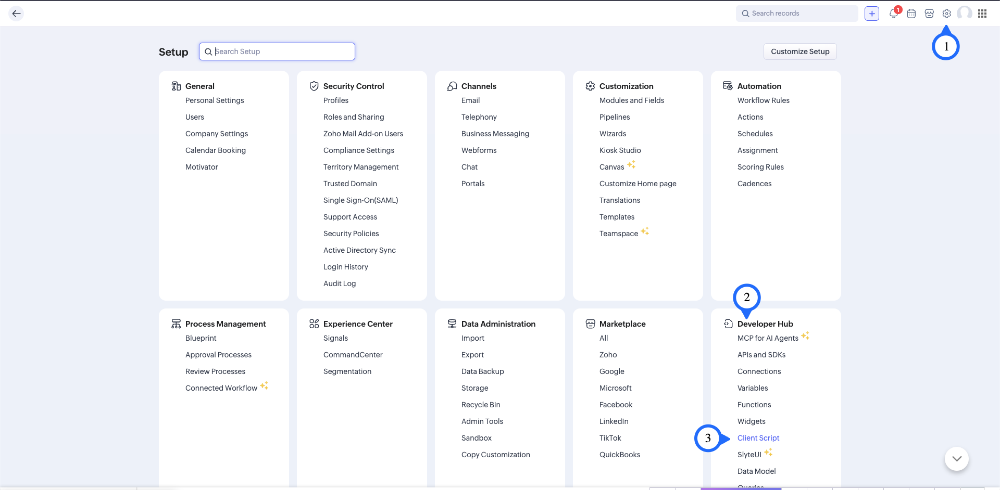
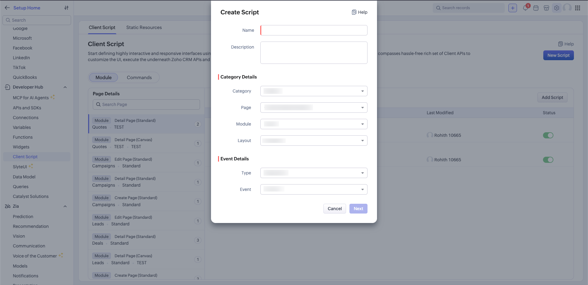
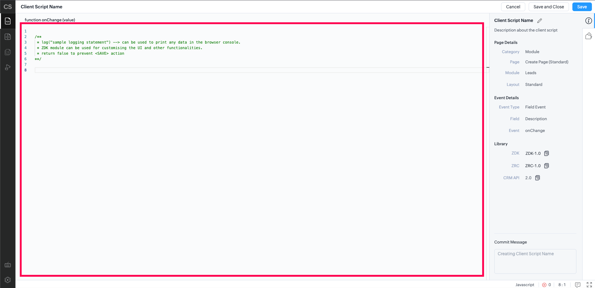
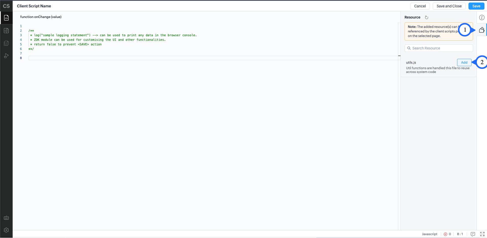
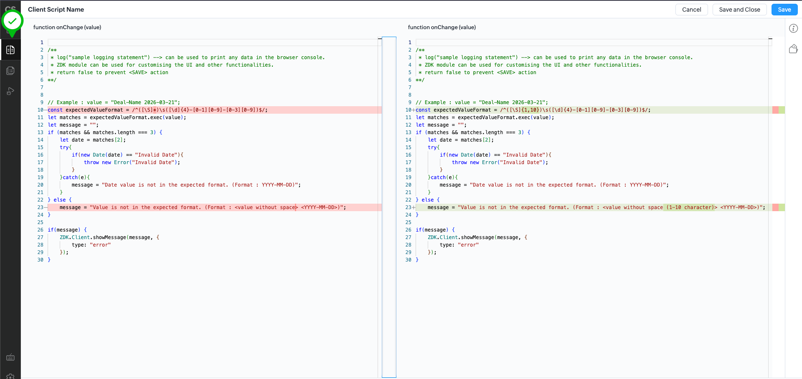
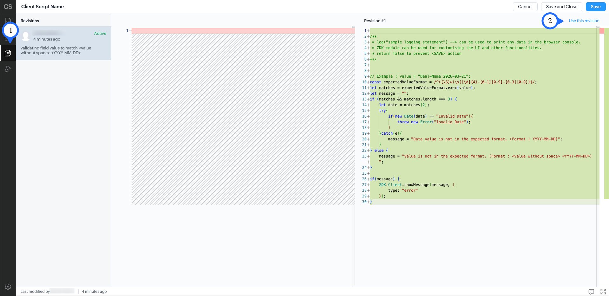
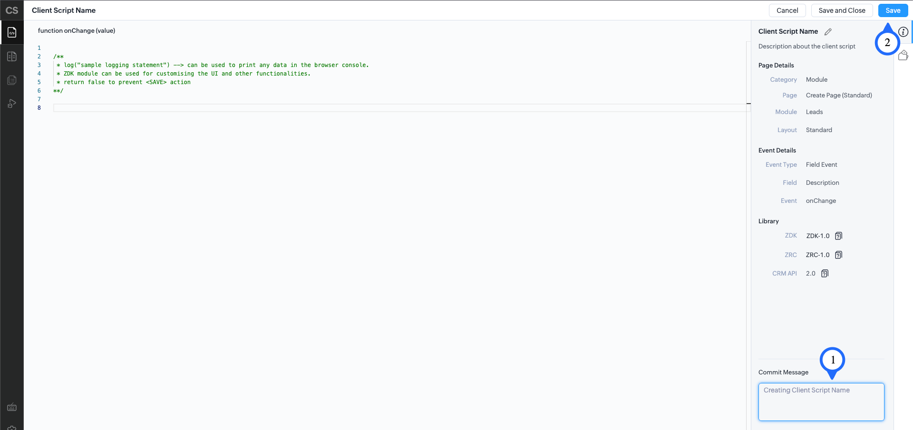

> **お知らせ**：当社は、お客様により充実したサポート情報を迅速に提供するため、本ページのコンテンツは機械翻訳を用いて日本語に翻訳しています。正確かつ最新のサポート情報をご覧いただくには、本内容の英語版を参照してください。

1. `設定 > 開発者向け情報 > クライアントスクリプト`に移動します。

2. **「新しいスクリプト」** ボタンをクリックし、必要な情報を入力します。

    - 名前
        - スクリプトを識別するための任意の名前
    - 詳細情報
        - スクリプトについての簡単な説明
    - カテゴリー
        - タブ：特定のモジュールでスクリプトをトリガーする場合。
        - コマンド：コマンドからスクリプトをトリガーする場合。
    - ページ
        - 作成ページ (標準)、編集ページ (標準)、詳細ページ（Standard）、複製ページ (標準)、一覧ページ（Standard）などのオプション。
    - モジュール
        - スクリプトをトリガーするCRMモジュールを選択します。
    - レイアウト
        - 選択したモジュールでスクリプトをトリガーするレイアウトを選択します。
    - キャンバス（ページ = キャンバス / モバイルキャンバスの場合）
        - スクリプトをトリガーするキャンバスを選択します。
    - 種類
        - ページの処理：ページの読み込み・保存・変更などのページイベントに基づいてスクリプトをトリガーします。
        - 項目の処理：特定の項目の値の変更に基づいてスクリプトをトリガーします。
        - サブフォームの処理：サブフォームで発生するイベントに基づいてスクリプトをトリガーします。
    - 項目（項目の処理の場合）
        - スクリプトをトリガーする項目を選択します。
    - サブフォーム（サブフォームの処理の場合）
        - スクリプトをトリガーするサブフォームを選択します。
    - イベント
       - 選択した種類のイベント。
3. **「次へ」** ボタンをクリックして、スクリプトエディターを開きます。

4. エディターでスクリプトを記述します。

5. スクリプトに依存するリソースが`設定 > 開発者向け情報 > クライアントスクリプト > 静的リソース`にアップロード済みの場合は、静的リソースを追加します。

6. 既存のスクリプトを編集している場合は、**レビュー**タブが表示され、前のバージョンとの変更内容を確認できます。

7. **変更**タブには、バージョン番号・変更日・変更者などの詳細とともに、スクリプトへのすべての変更履歴が表示されます。**「このバージョンを使用する」** ボタンをクリックすると、選択したバージョンのスクリプトエディターが開き、編集して新しいバージョンとして保存できます。

8. テスト実行ページでは、スクリプトの実行を操作し、スクリプトが生成するログをリアルタイムで確認できます。スクリプトのデバッグに役立ちます。

> **重要** : このテストで行ったデータ変更はCRMに反映されます。スクリプトのテストにはテスト用CRMレコードを使用することを推奨します。

9. 後から参照できるよう意味のあるコミットメッセージを入力し、**「保存する」** ボタンをクリックしてスクリプトを保存します。
