[](how-to-work.en.md)
[](how-to-work.ja.md)

# How to create widgets in Zoho CRM?

## What are widgets?

Widgets are embeddable UI components that you can create and add to your Zoho CRM. You can use widgets to perform functions that utilize data from third-party applications. You can build widgets for Zoho CRM using our [JS SDK](https://www.zohocrm.dev/explore/widgets/v1.5/jssdk#init). Widgets support [ZRC](https://www.zohocrm.dev/explore/widgets/v1.5/zrc_overview#what_is_zrc), enabling seamless and consistent API calls using unified syntax.

Widgets in Zoho CRM allow developers to extend the CRM UI by embedding custom HTML/CSS/JS based applications inside Related Lists, Web Tabs, Buttons, and other placeholders. This guide walks you through the entire lifecycle — from installing the **ZET CLI** to packing, deploying and testing the widget in your Zoho CRM account.

## Pre-requisites

- A Zoho CRM account in Professional, Enterprise and Ultimate editions with administrator privileges.
- [Node.js](https://nodejs.org/en/download) (LTS version recommended) installed on your machine.
- A code editor or an IDE (e.g., Visual Studio Code).
- Basic knowledge of HTML, CSS, and JavaScript.

## Limits

- You can create a maximum of 200 Widgets in Enterprise Edition and 200 in Ultimate Edition.

---

## 1. Install the ZET CLI

Zoho Extension Toolkit (ZET) is the command line interface used to scaffold, run, pack and deploy Zoho widgets/extensions.

Open your terminal and run:

```bash
npm install -g zoho-extension-toolkit
```

Verify the installation:
```bash
zet -v
```
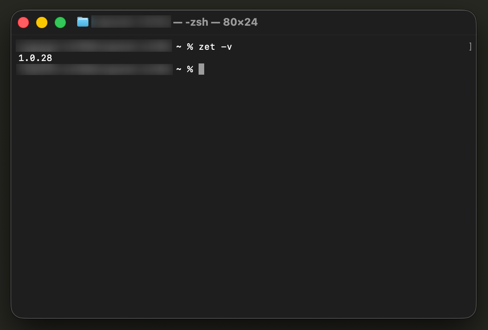

---

## 2. Initialize a new widget project

Navigate to the directory where you want to create your widget and run:

```bash
zet init
```

This command will show the list of Zoho Services for which you wish to create project template.

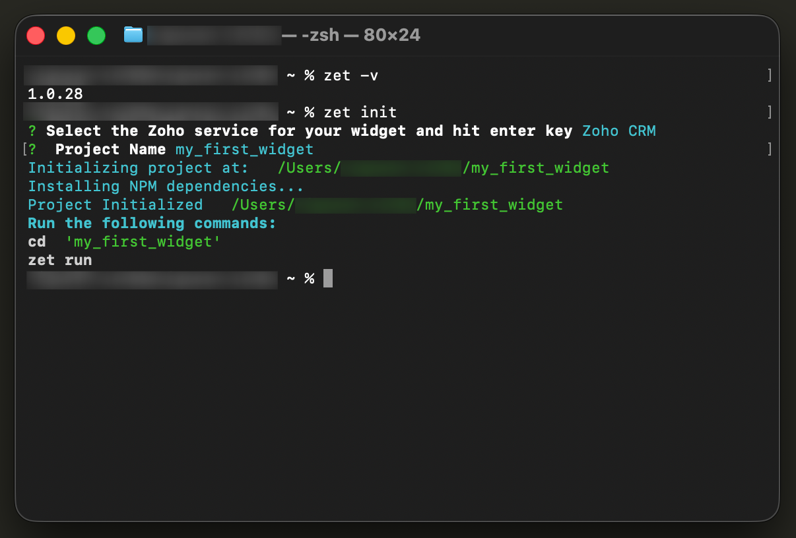

You will be prompted to:

- **Select the service** — Choose `Zoho CRM`.
- **Enter a project name** — Any meaningful name (e.g., `my_first_widget`).

ZET will scaffold the project with the following structure:

```
my_first_widget/
├── app/
│   └── widget.html
├── plugin-manifest.json
└── ...
```

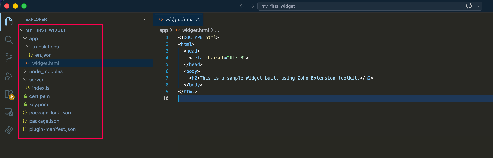

---

## 3. Review the `plugin-manifest.json`

When `zet init` scaffolds the project, it auto-generates a `plugin-manifest.json` in the project root. This file acts as the project descriptor and is served locally at `http://localhost:5000/plugin-manifest.json` when you run the development server.

A typical auto-generated manifest looks like:

```json
{
    "service": "CRM"
}
```

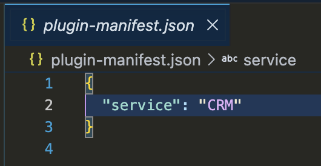

---

## 4. Write your business logic

Inside the `app/` folder, build the widget UI and logic.

- `app/widget.html` — Markup for the widget UI.
- `app/css/style.css` — Styling.
- `app/js/main.js` — Business logic. Use the [Zoho CRM JavaScript SDK (ZOHO.embeddedApp)](https://www.zohocrm.dev/explore/widgets/v1.5/jssdk#init) to interact with CRM data.

A minimal `main.js` looks like:

```javascript
ZOHO.embeddedApp.on("PageLoad", function (data) {
    console.log("Widget loaded with data:", data);
    // Your business logic here
});

ZOHO.embeddedApp.init();
```

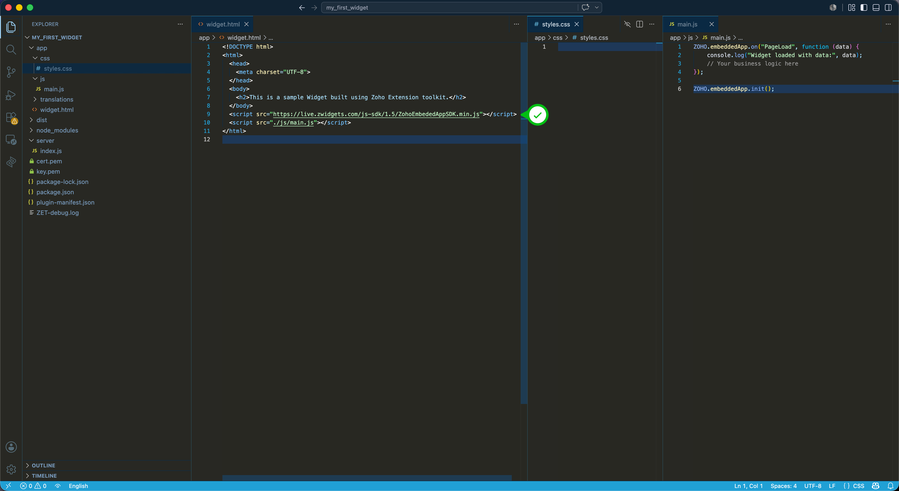

> **IMPORTANT** : Always call `ZOHO.embeddedApp.init()` **after** registering your event listeners.

> **NOTE** : The JS SDK `<script>` tag must be included in `widget.html` **before** any of your own JS files that invoke the SDK. Check [https://www.zohocrm.dev/explore/widgets/](https://www.zohocrm.dev/explore/widgets/) for the latest CDN URL of the SDK.

---

## 5. Run the widget locally (`zet run`)

Before packing and deploying, you can host the widget locally and test it inside Zoho CRM.

From the project root, run:

```bash
zet run
```

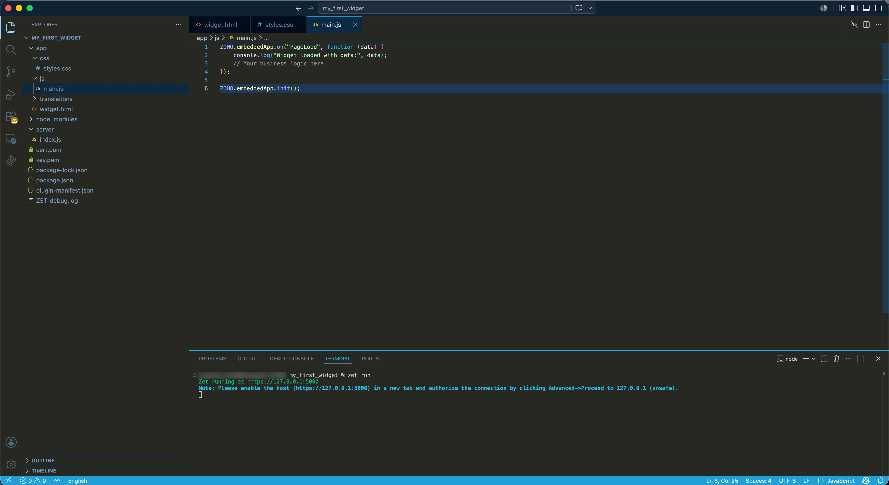

ZET will start a local HTTPS server (default: `https://127.0.0.1:5000`).

### Trust the local certificate

The first time you run `zet run`, the browser will warn about a self-signed certificate. Open `https://127.0.0.1:5000` in the browser and accept the certificate manually so that Zoho CRM can load the widget.

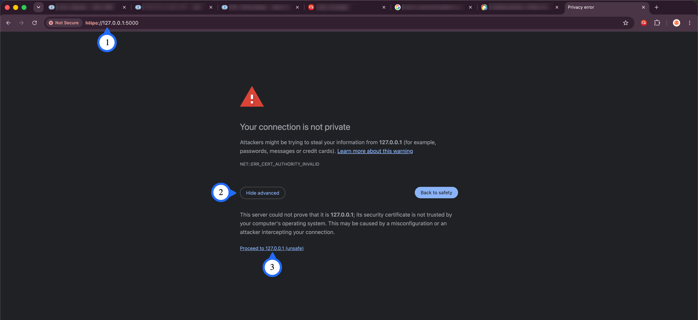

### Enable local widget testing in Zoho CRM

1. Go to `Setup > Developer Hub > Widgets`.
2. Click **"Create your First Widget"** (or **"+ New Widget"** if one already exists).
3. Enter the widget **Name**, select the **Widget type** (e.g., Related List, Web Tab, Button, Dashboard, etc.) and choose **Hosting** as `External`.
4. Enter the **Base URL** as `https://127.0.0.1:5000/app/widget.html` and click **Save**.

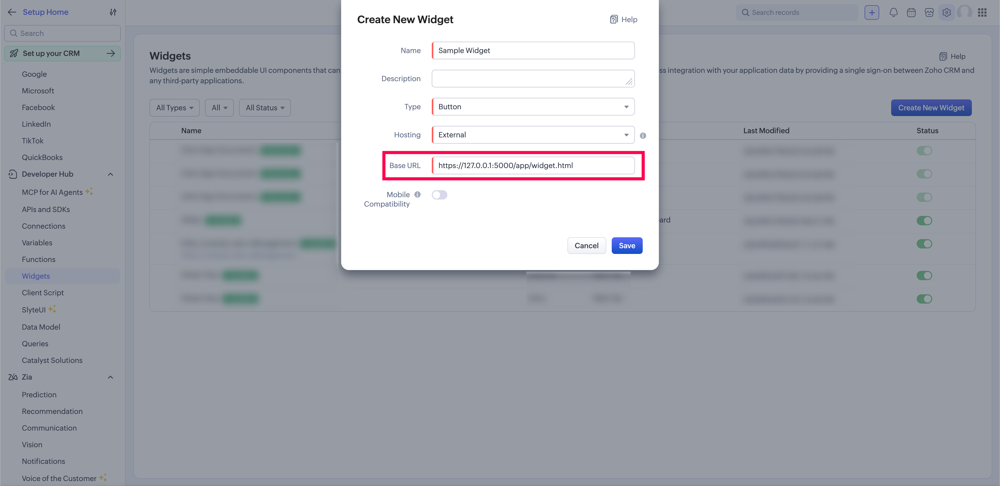

5. Navigate to the corresponding CRM page (e.g., a record's detail page) — your locally hosted widget will load inside CRM.

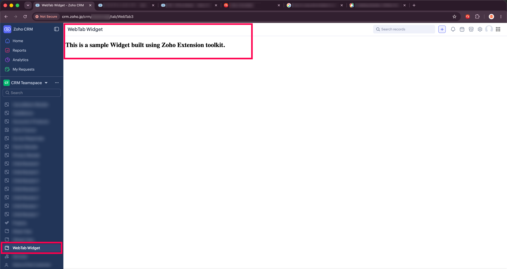

> **TIP** : You can edit the source files and refresh the CRM page to see the changes immediately, without re-packing.

---

## 6. Pack the widget

Once the widget is tested and ready, stop the local server (`Ctrl + C`) and run:

```bash
zet pack
```

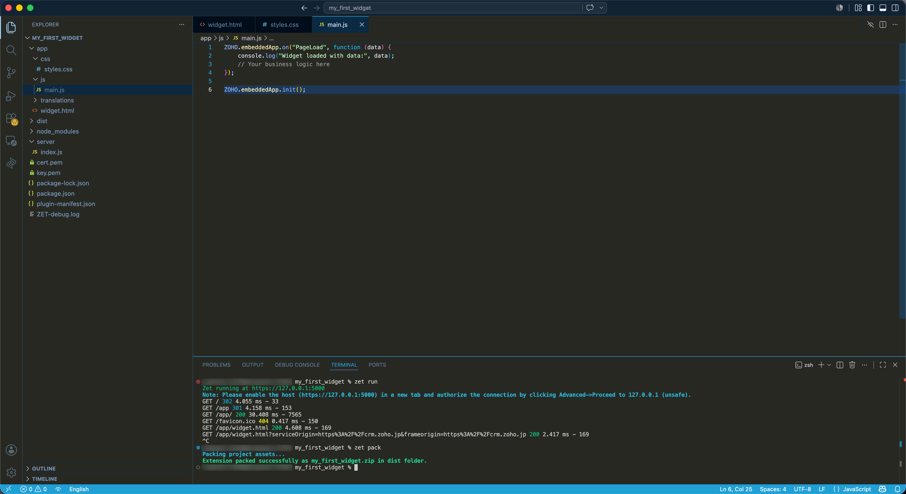

This generates a `.zip` file inside the `dist/` folder of your project. This zip is the deployable artifact.

---

## 7. Deploy the widget to Zoho CRM

You can upload the packed widget directly to enable other users to access and use the widget

1. Go to `Setup > Developer Hub > Widgets`.
2. Click **"+ New Widget"**.
3. Enter the **Name**, enter a **Description** (optional), select the **Widget type** and choose **Hosting** as `Zoho`.
4. Click **Upload**, select the `.zip` from the `dist/` folder, provide the **Index URL** (e.g., `/widget.html`) and click **Save**.

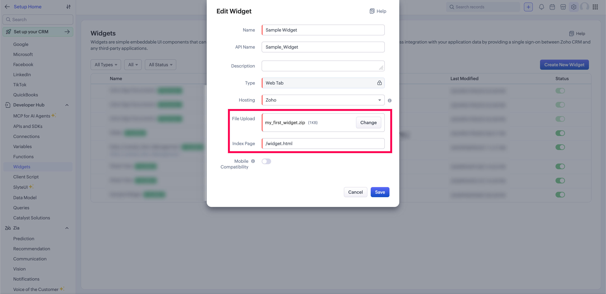

---

## 8. Test the deployed widget

1. Open the CRM page configured for the widget (Related List, Web Tab, Button, etc.).
2. Verify that the widget loads correctly and the business logic works as expected.
3. Use the browser's **Developer Tools (F12)** to inspect the widget iframe and debug `console.log` outputs.

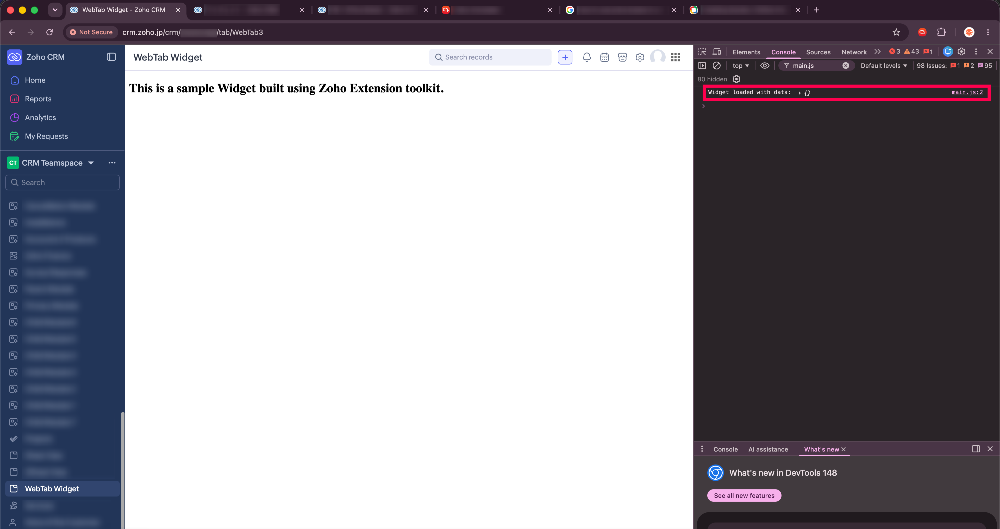

> **IMPORTANT** : <span style="color:red">Any data operation performed by the widget will reflect in the live CRM. Always use a sandbox/test CRM account or test records while validating the widget.</span>

---

## Useful references

- [Zoho CRM Widgets — Official Documentation](https://www.zoho.com/crm/developer/docs/widgets/)
- [Zoho CRM JavaScript SDK Methods](https://www.zohocrm.dev/explore/widgets/v1.5/jssdk#init)