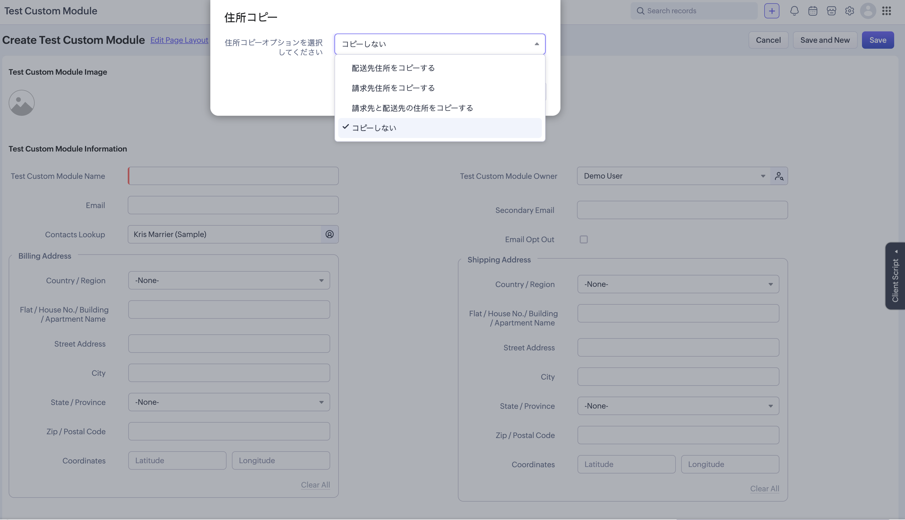
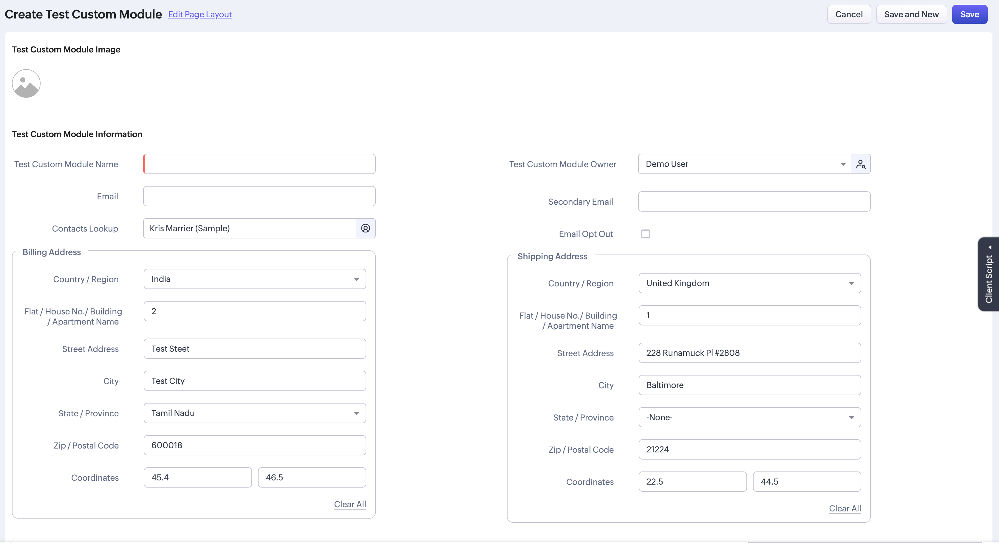

> **お知らせ**：当社は、お客様により充実したサポート情報を迅速に提供するため、本ページのコンテンツは機械翻訳を用いて日本語に翻訳しています。正確かつ最新のサポート情報をご覧いただくには、本内容の英語版を参照してください。

# カスタムモジュールへの連絡先住所の自動入力

このクライアントスクリプトは、連絡先の郵送先住所およびその他の住所を、カスタムモジュールに存在する配送先住所および請求先住所のフィールドにそれぞれ自動入力します。

カスタムモジュールの作成・編集・複製ページにおいて、連絡先ルックアップフィールドで連絡先を選択すると、スクリプトが連絡先の住所情報を取得し、ユーザーの確認後、カスタムモジュールの対応する住所フィールドにコピーします。

- 連絡先のその他の住所 → カスタムモジュールの請求先住所
- 連絡先の郵送先住所 → カスタムモジュールの配送先住所

# 機能

- 選択した連絡先のその他の住所から、請求先住所フィールドを自動入力します。
- 選択した連絡先の郵送先住所から、配送先住所フィールドを自動入力します。
- 各住所をコピーする前に確認ダイアログを表示し、選択的な入力を可能にします。
- カスタムモジュールの作成・編集・複製ページで動作します。

# スクリーンショット

# 関連リンク

セットアップおよび設定手順については、[configuration.ja.md](configuration.ja.md) を参照してください。